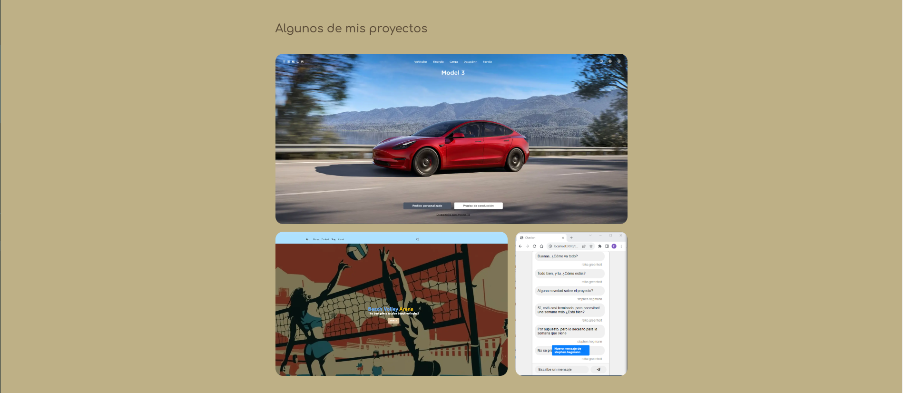

# Portfolio Web Astro
 
## Description
This is a portfolio web application that is built Astro theme from Tailwind CSS. It is a responsive web application. It is built with HTML, CSS, and JavaScript. It is deployed on Netlify. 

## Table of Contents

- [Portfolio Web Astro](#portfolio-web-astro)
  - [Description](#description)
  - [Table of Contents](#table-of-contents)
  - [Installation](#installation)
  - [Usage](#usage)
  - [Screenshots](#screenshots)
  - [Links](#links)
  - [Tests](#tests)
## Installation

To install the application, clone the repository from GitHub. Then, install the dependencies by typing 
```bash
npm install
``` 
on the terminal.

To clone the repository, you can type 
```bash
git clone https://github.com/FranGarciaLopez/quizer.git
```

## Usage

To use the application, type `npm start` on the terminal and the application will be launched on the browser.

## Screenshots




## Links

* [URL of the GitHub repository](https://github.com/FranGarciaLopez/portfolio.git "GitHub repository")

## Tests

There are no tests for this application at the moment.


